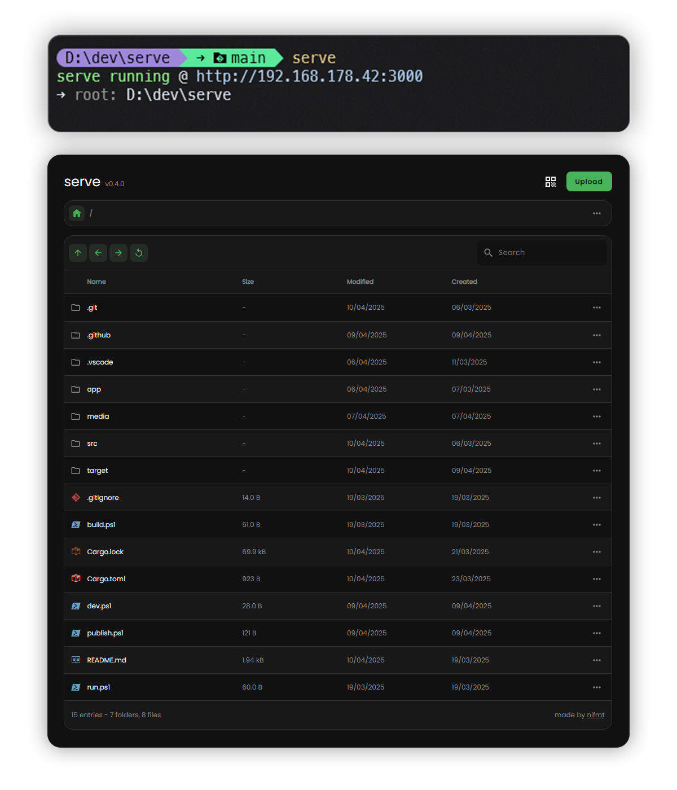

# serve

Quickly serve and receive files to/from anyone on your local network, using an easy web ui



## Features
- Easy and quick Uploads
- Zip Folder downloads
- Rename/Delete Files and Folders
- QR Code to connect
- Password Protection
- Sane Defaults
- Fast, thanks to rust backend
- Goodlooking UI

## Installation

Using cargo:
```sh
cargo install nlfmt-serve
```
```sh
serve --help
```

From source:
```sh
git clone https://github.com/nlfmt/serve
cd serve
# build frontend
cd app && pnpm i && pnpm build
cd .. && cargo install --path .
```
```sh
serve --help
```

Using the pre-built binaries:
Go to [the latest release](https://github.com/nlfmt/serve/releases/latest) and download the file for your operating system. Move it to any folder you want and add it to your PATH.

## Usage

```sh
serve [args] [path]
```

When running the `serve` command without any arguments, it will serve the current directory on port 3000, with all extra features like upload, file operations turned off.

Here is a list of flags available, or just run `serve --help`
```sh
serve -p 4001      # run on port 4001
serve -i 127.0.0.1 # only run on localhost (default is all interfaces - 0.0.0.0)

serve -u           # enable uploads
serve -q           # print QR Code when starting
serve -s           # resolve symbolic links when serving files/folders
serve -r           # allow renaming files
serve -d           # allow deleting files
serve -o           # allow overwriting files during upload

# you can combine these options
serve -uqs  # enable upload & symlinks, print QR Code

# add username & password
serve -a user:pass
# file of logins formatted as user:pass separated by newlines
serve --auth-file ./mylogins.txt
```

## Feature Plan

- [X] add download folder as zip or tar.gz
- [X] Uploads
  - [X] upload button in breadcrumbs, popup with drop zon
  - [X] drop zone anywhere in the window -> upload to current folder
  - [X] drop zone on folders => upload to that folder
- [ ] folder uploads (locked behind flag)
- [X] dont download symlinks, unless specified with flag
- [X] allow setting a password & username
  - `--auth, -a`, or `--auth-file` (maybe hashed?)
- [X] show error message when path was not found with a button "back to root"
- [ ] add logging to file
- [X] add progress bar popup
- [X] add support for multiple interfaces via `-i`, `--interface`
- [ ] support for custom headers
- [ ] tls support via `--tls-cert` and `--tls-key`
- [X] context menu
  - [X] allow creating directories
  - [X] file/folder info popup
  - [X] delete/rename ? (secured behind flag)
- [X] add right click action api & args
  - [X] rename
  - [X] delete
  - [X] create folder
- [X] add qr code button on mobile
- [ ] lock zip generation behind flag, add tar/tar.gz
- [X] show symlink symbol in UI
- [X] add good error logging in cli
- [X] automated compile pipeline with releases
- [ ] recursive file search (streamed)
- [ ] custom download ui & progress
- [ ] chunked uploads & download
  - [ ] resumable uploads & downloads
- [X] insert prev name in rename dialog and select the text
- [ ] allow moving files/folders using drag and drop